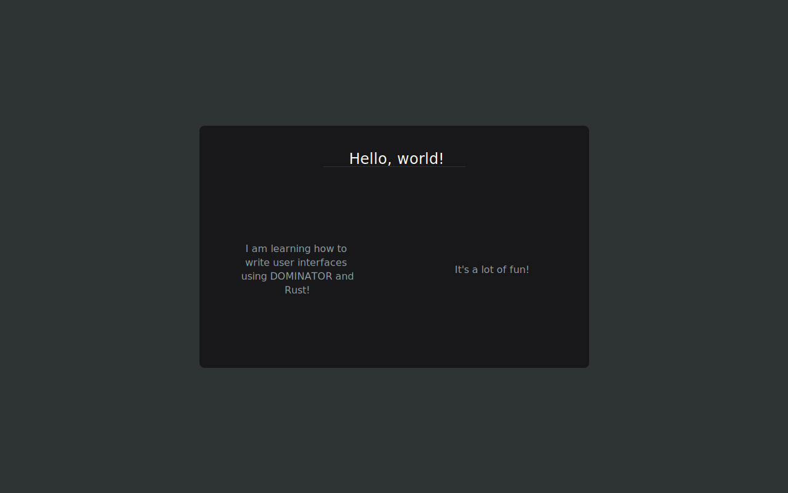

# Dominator video course homework - part 1

This exercise consists of 2 parts. 
The first part is simply installing the toolchain you will need for the rest of the course.
The second part will be to implement a small reference design, just to get the hang of things.


## Installing the tools

The first thing you will need to get is rust itself.
Go to https://rustup.rs/ and follow the instructions for your platform.

After that, you will need to add the `wasm32-unknown-unknown` target by running 

```shell
rustup target add wasm32-unknown-unknown
```

Lastly, you need a way to run the project.
You can choose if you wish to use Trunk or NPM

### NVM 

For NPM instead, go get nvm (node version manager) installed: https://github.com/nvm-sh/nvm

### Trunk

Head on over to https://trunkrs.dev/guide/getting-started/installation.html and follow their install instructions.

## Running the assignment starting point

Now that your tools are installed, go to the `homework/p1-getting-started` directory.

From there, simply run`trunk serve open`.

This should build the application, and start a web server hosting it locally for you and open in the browser.

For the NPM users, do the following:

```shell
nvm install
npm install
npm start 
```

## The second part

Now that you have things running, it's time to change some code and make a pretty UI!

The task is to implement the design found in `homework/p1-getting-started/design/page-design.svg`.



Some hints: 

* You will be doing your work in the files `homework/p1-getting-started/src/lib.rs` and `homework/p1-getting-started/html/style/example.scss`
* The colors used in the reference design are 
```css
/* elements*/
#2e3434
#18181a 
/* text: */
#ffffff
#8f9da3
* ```
* Border radius 8px
* Flex layout is your friend! Check out https://css-tricks.com/snippets/css/a-guide-to-flexbox/ to master it! 

